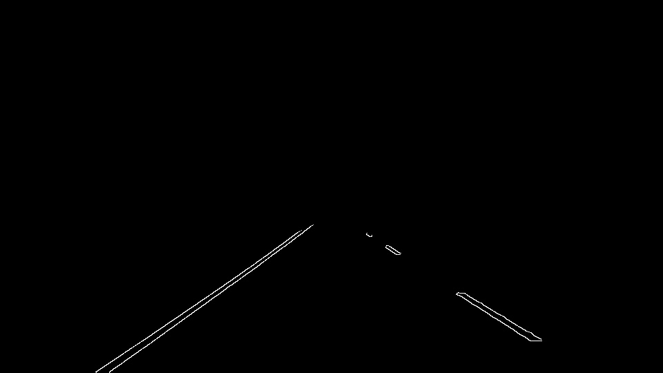
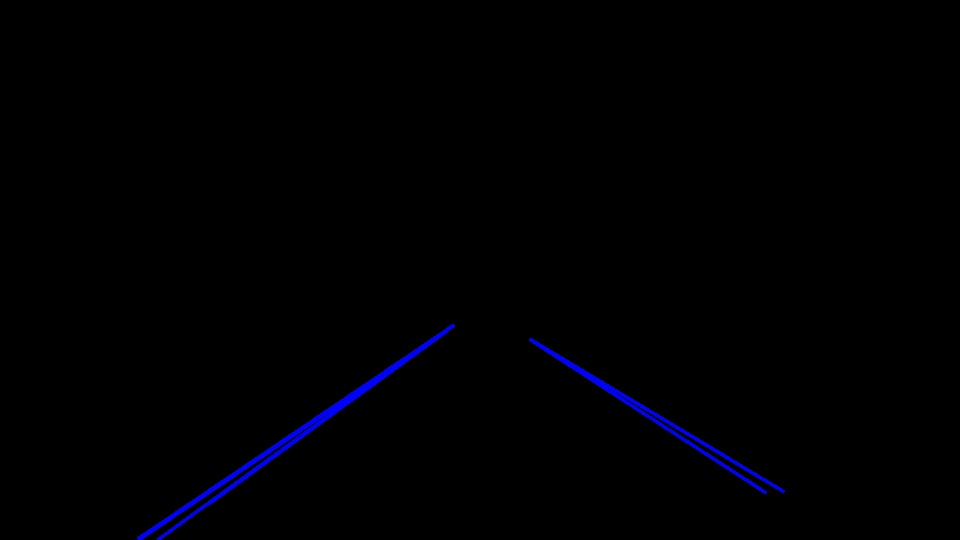
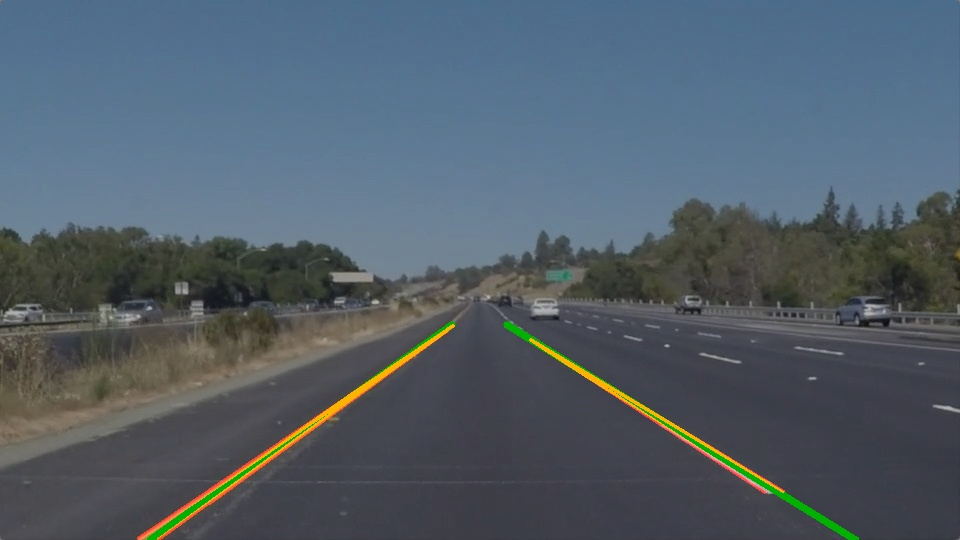

# **Finding Lane Lines on the Road** 

<i>Clark Hochgraf
 Dec 29, 2019</i>

The goals / steps of this project are the following:
* Make a pipeline that finds lane lines on the road from a color image.
* Reflect on the performance of the pipeline and potential enhancements

[//]: # (Image References)

[image1]: ./examples/grayscale.jpg "Grayscale"
[image2]: ./test_images/solidWhiteCurve.jpg "Solid White Curve"

---

## Reflection

### 1.Description of Pipeline, including modification of the draw_lines() function.
    
My pipeline consisted of 6 steps. At each stage the image output was renamed for clarity e.g. for the conversion to grayscale, the image became img_g. 

* The image was converted from color to grayscale (img_g). 
* Next, the image was blurred with a gaussian filter with 9x9 kernel (img_gb). 
* Canny edge detection was applied with a low threshold of 40, and high of 80 (img_gbc). 
* The vertices of a region of interest were found and applied to mask of the region where lane lines are expected while ignoring other regions of the image (img_gbcr). 

* Then a hough transform was used to find lines in the image (img_gbcrl).
* Finally, the average lines were then overlayed on the original image (img_gbcrlw).

In order to draw a single line on the left and right lanes, I modified the <strong>draw_lines()</strong> function so that only lines that fit into a model of "left lane" or "right lane" were kept. First the slope and offset of each line was found, lines with slopes and offsets that were not "left lane" or "right lane" were discarded. The average slope and offset was found for the remaining left lane lines and then the right lane lines. 

---

### 2. Shortcomings with current pipeline

A few noticeable shortcoming of the current pipeline include:
1. In the road videos, the lane marker line overlay is jittery, jumping around from frame to frame. While not inaccurate, it is distracting.
2. When the lane contrast is low, such as in the challenge video where a yellow lane goes over a concrete bridge, the hough transform can fail to detect the lane. This can be noticed as the lane line holds a fixed position for a number of video frames and then jumping to the correct lane location once the lane image has sufficient contrast.
3. The lane markers are at times longer than the lane in the image. 
4. The lane markers are straight lines and do not match the curvature of the lane.
5. The thresholds for region of interest, canny, are hardcoded.
6. If no lines are detected in the image, a run-time error NONETYPE will occur in the draw_lines() function

### 3. Possible improvements to pipeline

To address these shortcomings, the following improvements could be made:
1. For the jittery lane markers, adding a low pass filter to smooth the lane marking locations could improve the visual display of the lane marker and also reduce jitter in the steering wheel command later during self-driving. The filter will have to respond fairly quickly so as to not impair the steering response as the car drifts in the lane
2. Improved contrast through analysis in the color space might make it easier to detect a faded yellow lane on concrete.
3. The lane marker length could be fine tuned based on information such as image size/shape, output of canny and hough transforms
4. The lane markers could be modified to be curved lines or segmented lines.
5. The thresholds could be parameterized for more convenient tuning.
6. Add error handling for the case where no lines are detected in an image.

---
